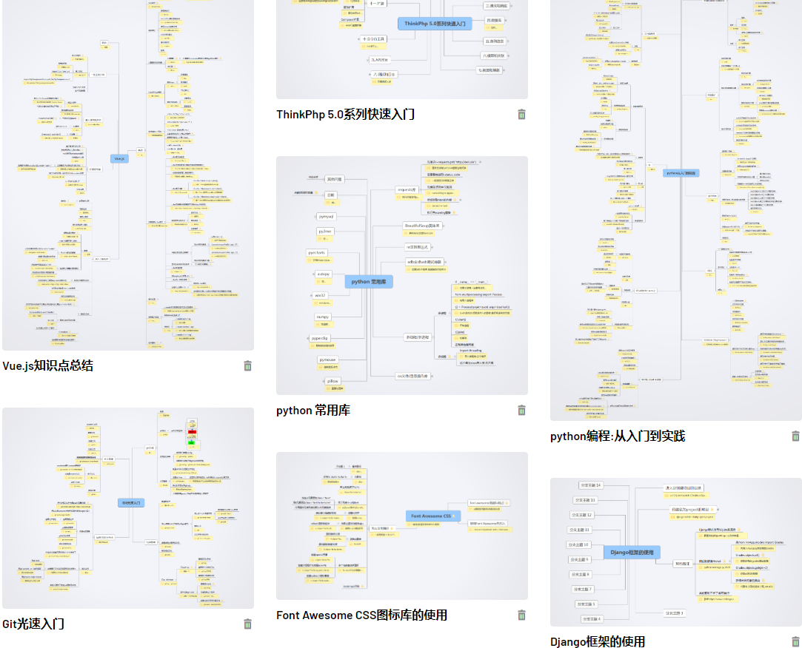
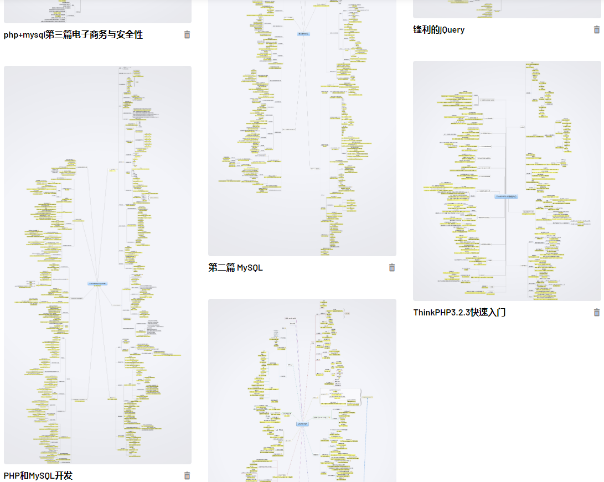

# 自己几年下来总结的各种知识点,可以当手册查询使用
## 内容包含
- 锋利的jQuery笔记.xmind
- 网站模块.xmind
- Django框架的使用.xmind
- Font Awesome CSS框架.xmind
- Git光速入门.xmind
- javascript编程艺术笔记.xmind
- Laravel学习.xmind
- NoSQL相关学习.xmind
- php+mysql第二篇 MySQL.xmind
- php+mysql第三篇电子商务与安全性.xmind
- PHP+MySQL第四篇 PHP的高级技术.xmind
- php+mysql第五篇 创建实用的php和MySQL项目.xmind
- PHP和MySQL开发学习笔记.xmind
- python 常用库.xmind
- python从入门到实践.xmind
- ThinkPhp 5.0系列快速入门.xmind
- ThinkPHP3.2.3快速入门.xmind
- Vue教程.js.xmind
- Airtest 自动化测试.xmind
- Python scrapy框架.xmind

> 点击这里可查看详细缩略图:<https://www.xmind.net/share/benteng/>

## 欢迎收藏fork,也会一直持续更新新内容
